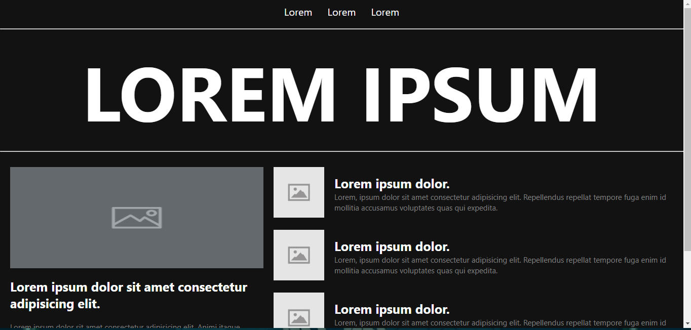
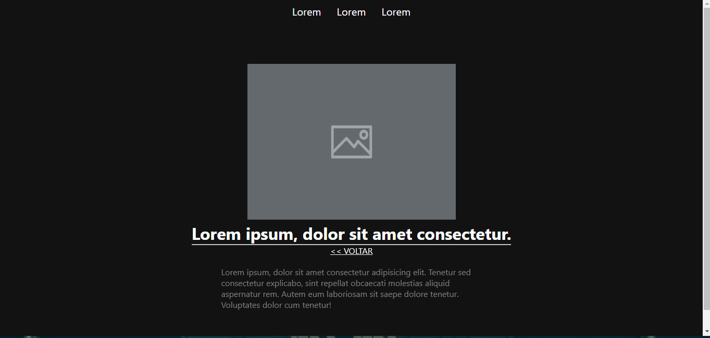

# <h1 align="center">Blog</h1>

## Descrição do Projeto:

Esse projeto foi desenvolvimento a partir de um <a href="https://dribbble.com/shots/18089191-Blog-Layout">Layout de blog<a> para aumentar os meus conhecimentos e capacidade no desenvolvimento e de estruturação de componentes usando <a href="https://angular.io/">Angular.</a> Juntamente com o <a href="https://www.typescriptlang.org/">TypeScript</a> para deixar o conteudo da página dinamico.

## Project Description:

This project was developed from a <a href="https://dribbble.com/shots/18089191-Blog-Layout">Blog Layout</a> to increase my knowledge and capacity in the development and structuring of components using <a href="https://angular.io/">Angular.</a> Along with <a href="https://www.typescriptlang.org/">TypeScript</a> to make the page content dynamic.

<h2 align="center">

</h2>

<h3 align="center">
  
  
</h3>

### 🛠 Tecnologias / Technologies

As seguintes ferramentas foram usadas na construção do projeto / The following tools were used in building the project:

- [HTML](https://www.w3schools.com/html/)
- [CSS](https://www.w3schools.com/Css/)
- [TypeScript](https://www.typescriptlang.org/)
- [Angular](https://angular.io/)

<h2>:hammer: Créditos</h2>

Web Page feito por / Web Page made by:

<a href="https://github.com/gustavo-freita">Gustavo Freitas</a> <a href="https://github.com/gustavo-freita">
