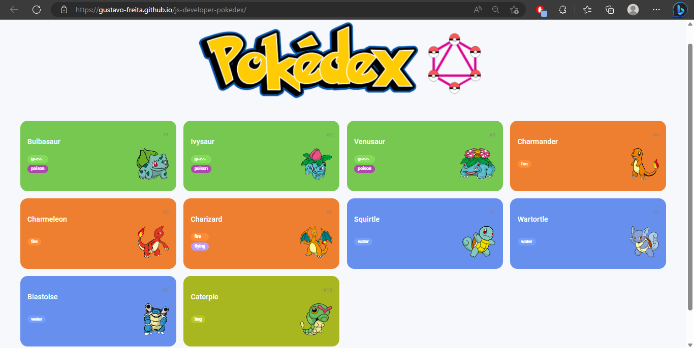
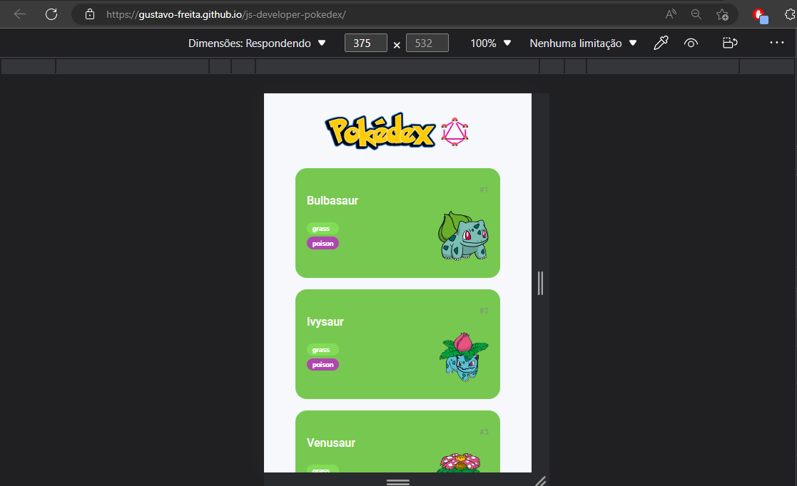
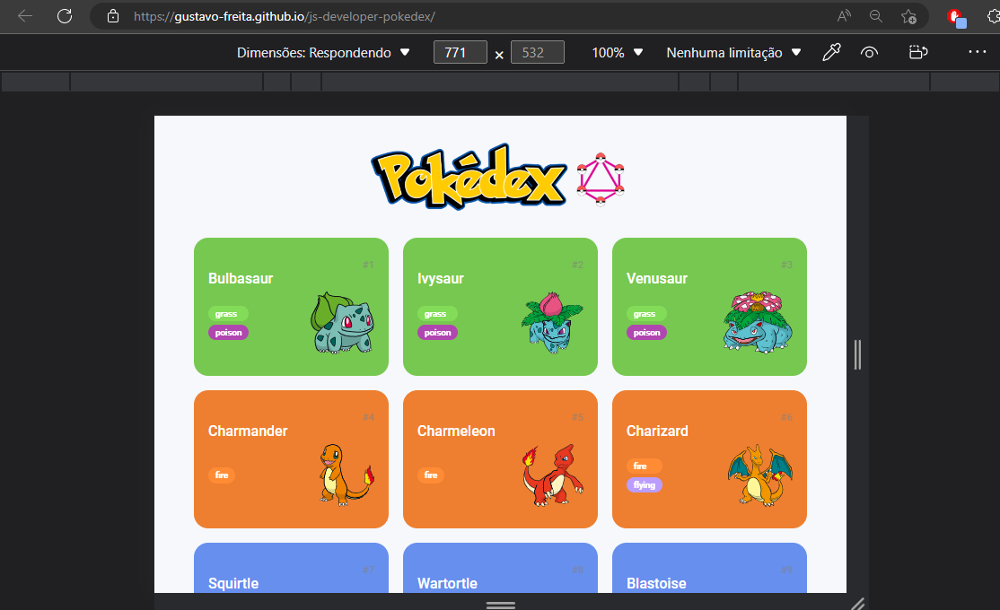

# <h1 align="center"><a href="https://gustavo-freita.github.io/js-developer-pokedex/">Pokedex</a></h1>

## Descrição do Desafio:

 Desenvolver uma criação de uma Pokédex para explorar o mundo Pokémon através do consumo de uma API REST, você irá explorar, além do JavaScript, todos os fundamentos de desenvolvimento Web aprendidos até aqui.

<h2 align="center">

</h2>

<h3 align="center">
  
  
  
</h3>

### 🛠 Tecnologias

As seguintes ferramentas foram usadas na construção do projeto:

- [HTML](https://www.w3schools.com/html/)
- [CSS](https://www.w3schools.com/Css/)
- [JavaScript](https://developer.mozilla.org/en-US/docs/Web/JavaScript/Guide/Introduction)
- [PokeAPI](https://pokeapi.co/?ref=public-apis)
